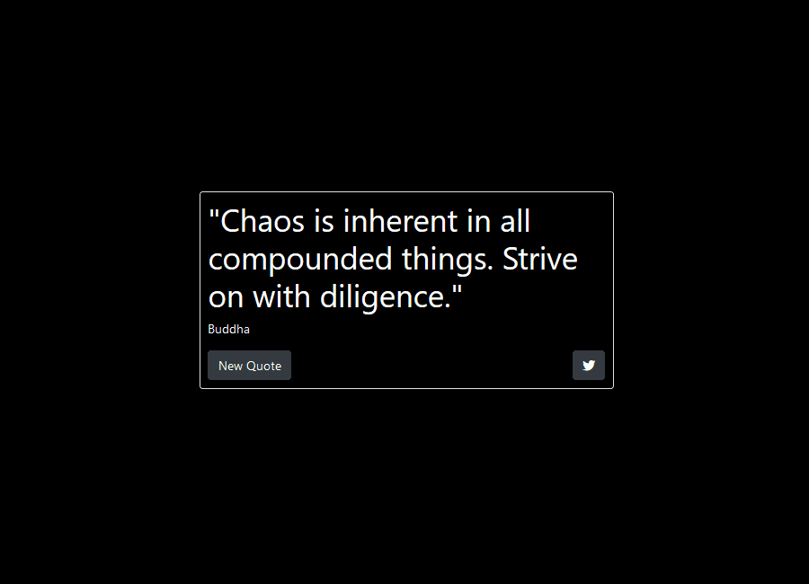

# Random quote generator
A random quote generator using React, made as a project for FreeCodeCamp's 'Front End Libraries' certification.

The app can be used with two jsx files: script.jsx or script-hooks.jsx. The only difference is the implementation, with the first using class components and the second using hooks.

## Demo


## Installation and Usage
This app can be used by running a local server by typing the following command in the root directory (with python installed):

```bash
python -m http.server
```

## License
[MIT](https://choosealicense.com/licenses/mit/)